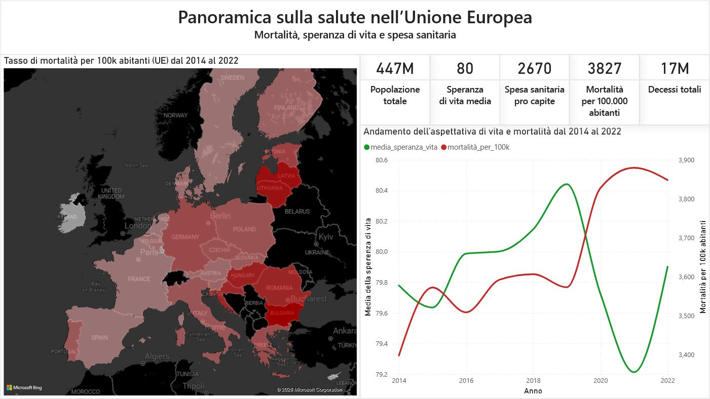

# Health EU27 Data Project

------------------------------------------------------------

# OVERVIEW

The Health EU27 Data Project is a structured data engineering and analytics initiative focused on European Union health indicators.

The objective is to clean, standardize, and harmonize multiple public health datasets to enable cross-country comparisons, trend analysis, and further data exploration.

The project implements a modular ETL pipeline and produces analysis-ready datasets in both English and Italian.

------------------------------------------------------------

# PROJECT STRUCTURE

data/
- raw/                              Original datasets
- processed/                        Cleaned datasets (ETL output)
- processed_it/                     Translated datasets (Italian)

src/
- main.py                           Runs the full ETL pipeline
- transform.py                      Data cleaning and standardization
- translate_it.py                   Italian translation module
- load.py                           Loads datasets into MySQL
- add_missing_population_it.py      Adds missing population to population dataset (Italian country names)
- utils.py                          Helper functions
- config.py                         Project configuration

docs/
- data_dictionary.md
- methodology.md
- project_brief.md
- data_issues_summary.md

notebooks/
- visualization.ipynb  Exploratory Data Analysis template

Root files:
- requirements.txt
- README.md

------------------------------------------------------------

# DATASETS INCLUDED

The project integrates the following EU health datasets:

1. Population
2. Life Expectancy
3. Health Spending
4. Mortality Causes
5. Chronic Diseases Prevalence

All datasets are standardized to EU27 countries only and prepared for analytical consistency.

------------------------------------------------------------

# WORKFLOW

1) Run ETL pipeline:
   python -m src.main

2) Create MySQL database and tables:
   Run the provided schema script.

3) Load data into MySQL:
   python -m src.load

4) Open Power BI:
   Open interface.pbix and connect to the MySQL database.

------------------------------------------------------------

The process is fully reproducible from raw data to visualization.

------------------------------------------------------------

# ANALYTICAL CAPABILITIES

The prepared datasets enable:

- Cross-country comparisons
- Gender-based analysis
- Time-series trend analysis
- Correlation studies
- Health spending vs outcomes exploration
- Mortality cause distribution analysis
- Chronic disease prevalence comparisons

------------------------------------------------------------

# DOCUMENTATION

Detailed documentation is available in the docs folder:

- data_dictionary.md
- methodology.md
- project_brief.md
- data_issues_summary.md

These files contain dataset definitions, transformation logic,
project scope, and data quality notes.

------------------------------------------------------------

# TECHNICAL STACK

- Python
- Pandas
- Jupyter Notebook
- Modular ETL architecture
- MySQL integration
- Markdown documentation

------------------------------------------------------------

# DESIGN PRINCIPLES

- Reproducible ETL workflow
- Modular and maintainable codebase
- Clear separation between raw, processed, and translated data
- Transparent data transformations
- Production-style project organization

------------------------------------------------------------

# SCREENSHOTS

## Main Dashboard Preview

